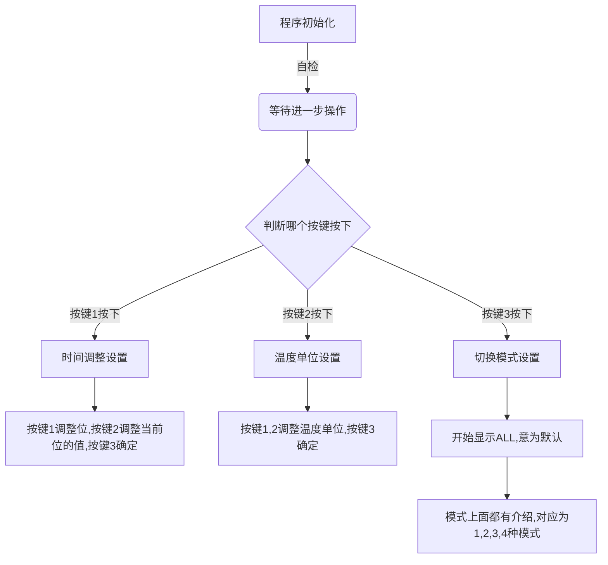

# 多功能小时钟

## 主体简介

**简单介绍：**

​	这一个使用了STC15W408AS单片机的小时钟，拥有温度显示和时间显示。并且还有亮度调节功能，以及距离感应功能（实现挥手唤醒）

**主要使用器件：**

* [STC15W408AS单片机](https://item.taobao.com/item.htm?spm=a1z10.3-c-s.w4002-21223910208.9.10446a4bjn0giY&id=533673879203)
* [LM75A温度芯片](https://item.taobao.com/item.htm?spm=a1z10.3-c-s.w4002-21223910208.9.51ca6a4bzalnL1&id=522574182103)
* [74HC164串转并芯片](https://item.taobao.com/item.htm?spm=a1z10.3-c-s.w4002-21223910208.9.14d26a4buTYBAY&id=522555283078)（后面发现这个芯片会有鬼影现象，准备更改为74HC595芯片）
* *更多关键芯片待添加…………*

**预览图：**

**时间显示：**

​	通过中间的时钟点来区分小时和分钟，中间的点每隔0.5S切换一次状态（即2Hz的频率闪烁）

**温度显示：**

​	通过第二位的小数点来区分温度的小数位，采用的LM75A芯片可以达到的温度分辨率为0.125，即显示29.8°C其实是29.875°C

***

## 使用说明

**显示模式：**

​	显示模式一共有三种：

* 常亮显示(-01-)
* 每隔5S温度时间切换显示(-02-)
* 挥手进行唤醒/切换，唤醒5S后自动熄灭，唤醒时通过再次挥手切换温度和时间界面(-03-)
* 重新校准距离传感器的基准数值，防止传感器失灵(直接显示数字)

**按键设置：**

​	按键设置一共分为两层，第一次按下是选择功能，第二次按下是功能设置

***

更多的信息等待被更新和添加…………

> 编程思路参考文献：
>
> 《爱上单片机》杜洋著  ISBN：9787115222572